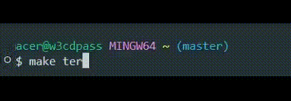
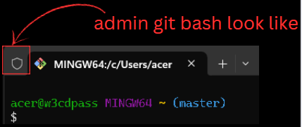
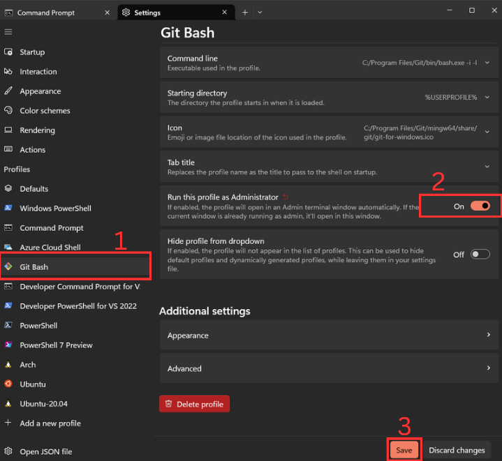
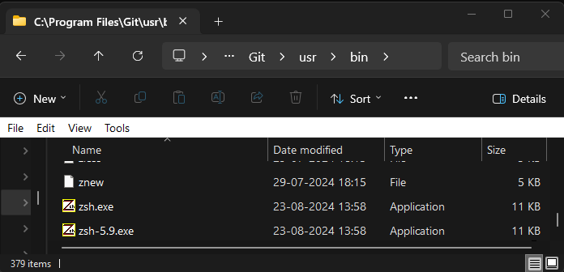
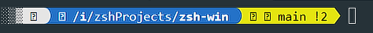

# zsh-win

<table width="100%">
  <tr>
    <td align="center" style="width: 50%;">
      
    </td>
    <td align="center" style="width: 50%;">
      
    </td>
  </tr>
</table>

***
[](https://www.npmjs.com/package/zsh-win)
[](https://github.com/w3cdpass/zsh-win)
[](https://www.npmjs.com/package/zsh-win)
***


## Table of Contents

- [Installation](#-installtion)
- [Issue](#the-issue-title)
  - [Git bash is not opening as admin in windows](#issue-1)
  - [`zsh` cmd not found](#issue-2)
  - [Icon/Symbols are missing](#issue-3)
  - [Custom zsh-theme is not working](#step-4)


# 🤓 Installation
  * ## Prerequisites
    - **[Git Bash](https://git-scm.com/download/win)**: A command-line interface for Windows that provides a Unix-like shell. 
    - **[Node.js](https://nodejs.org/en/download/)**: A JavaScript runtime that allows you to run and install npm packages.  
****
### To avoid issue
1. Downloads these four .ttf files:

    - [MesloLGS NF Regular.ttf](https://github.com/romkatv/powerlevel10k-media/raw/master/MesloLGS%20NF%20Regular.ttf)
    - [MesloLGS NF Bold.ttf](https://github.com/romkatv/powerlevel10k-media/raw/master/MesloLGS%20NF%20Bold.ttf)
    - [MesloLGS NF Italic.ttf](https://github.com/romkatv/powerlevel10k-media/raw/master/MesloLGS%20NF%20Italic.ttf)
    - [MesloLGS NF Bold Italic.ttf](https://github.com/romkatv/powerlevel10k-media/raw/master/MesloLGS%20NF%20Bold%20Italic.ttf)

2. Double-click on each file and click "Install". This will make MesloLGS NF font available to all applications on your system.

Visual Studio Code: Open File → Preferences → Settings (PC) or Code → Preferences → Settings (Mac), enter `terminal.integrated.fontFamily` in the search box at the top of the Settings tab, and set the value to `MesloLGS NF`. Consult <a href="https://raw.githubusercontent.com/romkatv/powerlevel10k-media/389133fb8c9a2347929a23702ce3039aacc46c3d/visual-studio-code-font-settings.jpg" style="text-decoration: underline;">this screenshot</a> to see how it should look, or see <a href="https://github.com/romkatv/powerlevel10k/issues/671" style="text-decoration: underline;">this issue</a> for more information.


****
# Step #1
> ⚠️ **IMPORTANT:** Don't skip this step.

## Run `git bash` as `admin`
  - **Press:** 
<span style="background-color:#e1e1e1;border-radius:3px;padding:2px 6px;color:black;"><strong>Windows</strong></span> + 
<span style="background-color:#e1e1e1;border-radius:3px;padding:2px 6px;color:black;"><strong>Key</strong></span> → 
<span style="background-color:#e1e1e1;border-radius:3px;padding:2px 6px;color:black;"><strong>Git Bash</strong></span> → 
<span style="background-color:#e1e1e1;border-radius:3px;padding:2px 6px;color:black;"><strong>Run as Administrator</strong></span>

</p>
  - Above instruction is not working `goto` issue <a href="#" style="text-decoration: underline;">git bash is not opening as admin on windows</a>.

****
# Step #2
  1. Install from `NPM`
```bash
npm i zsh-win # after installation
# type zsh-win on git bash to see the magic 🪄.
zsh-win
```
2. From `source code`
```
  git clone https://github.com/w3cdpass/zsh-win.git
  cd zsh-win
  npm i
  node js/index.cjs
```
   > Note: Run the `git bash` as `admin` to install from `source code`

# Step #3


- * Choose theme between them.
- * ❤️ Custom is great. If any issue with `custom` reffer this <a href="#issue" style="text-decoration:underline">issue</a>.

# Step #4⚡
## 🪄 After installation type `zsh-win` to see the magic in `git bash`

## Welcome to `Customization` ✨
- ## Example #1 🥱
  ```bash
  vim ~/.zshrc 
  ```
  - Search for `ZSH_THEME="agnoster"` .
  - Change the value `ZSH_THEME="cloud"` and save it .
  - Type `zsh` on `git bash` to activate theme .

  > Note: You can select any zsh `theme` from  <a href="https://github.com/ohmyzsh/ohmyzsh/wiki/Themes#robbyrussell" style="text-decoration:underline;">`ohmyzshthemes`</a> .
- ## Example #2 😎🔥
  * ### Wants to use another seprate `zsh theme` that is not in [~/.oh-my-zsh](https://github.com/ohmyzsh/ohmyzsh/tree/master/themes).
  Like <a href="https://github.com/romkatv/powerlevel10k" style="text-decoration:underline;">`powerlevel10k`</a> and [more](https://github.com/ohmyzsh/ohmyzsh/wiki/External-themes#simplerich-theme)
  ___
  ```bash
  # powelevel10k
  # use this cmd in git bash
  git clone --depth=1 https://github.com/romkatv/powerlevel10k.git ${ZSH_CUSTOM:-$HOME/.oh-my-zsh/custom}/themes/powerlevel10k
  # ZSH_THEME="powerlevel10k/powerlevel10k"
  sed -i.bak -e '/^ZSH_THEME=/c\ZSH_THEME="powerlevel10k/powerlevel10k"' -e '/source ~\/powerlevel10k\/powerlevel10k.zsh-theme/s|source ~/|source ~/.oh-my-zsh/custom/themes/|' ~/.zshrc && echo 'source ~/.oh-my-zsh/custom/themes/powerlevel10k/powerlevel10k.zsh-theme' >> ~/.zshrc && echo '[[ ! -f ~/.p10k.zsh ]] || source ~/.p10k.zsh' >> ~/.zshrc && zsh

  ```
  - Then type `p10k configure` or `zsh` . _to use it_ 

     __For Instance__: Add custom themes in `./oh-my-zsh/custom/themes` folder with `theme.zsh-theme` .
## The issue title

### _ISSUE_ __#1__
Git bash is not opening as `admin` in `windows` .
  > Try Manually
  * Tested on Windows 11
  * Open Command Pormpt .
  * Type `ctrl + ,` go to setting .
  * Click the `Git bash` profile .
  * Check the button `Run this profile as Administrator` .

    <p></p>

    - Then go to [`Step #2`](#step-2)

### _ISSUE_ __#2__
`Zsh` command not found .
  
  > Try Manually
  * Download the `both` .exe files from [`source code`](https://github.com/w3cdpass/zsh-win/tree/main/js/zsh) .
  * Paste these .exe in `C:/Program Files/Git/usr/bin` , Where `Git` is installed .
  
    <p></p>

      - Then go to [`Step #2`](#step-2)

### _ISSUE_ __#3__
Icon/Symbols are `missing`.

* Follow these [`steps`](#to-avoid-issue) .
* Before you start, install those `.ttf` on you system
* Then Restart your `IDe` .
* After installation
  -  
  - 

  > Refreance: Still doesn't work  [`follow this link`](https://github.com/romkatv/powerlevel10k/issues/671) .


### _ISSUE_ __#3__

Custom `zsh-theme` is not working .
* All custom themes of `Zsh` are in `~/.oh-my-zsh/custom/themes`
* Make sure the the `custom.zsh-theme` exist.[text](c:/Users/acer/Downloads/README.md)
* Then change the value `ZSH_THEME="custom"` in `.zshrc`.


## Contributors 🤗
| [<br /><sub><b>w3cdpass</b></sub>](https://github.com/w3cdpass) | [<br /><sub><b>Kupasva</b></sub>](https://github.com/kupasva) | [<br /><sub><b>genrator-lgtm </b></sub>](https://github.com/genrator-lgtm) |
| :---: | :---: | :---: |

### How to Contribute
If you'd like to contribute, please fork the repository and use a feature branch. Pull requests are warmly welcome.

1. Fork the repository
2. Create your feature branch (`git checkout -b feature/YourFeature`)
3. Commit your changes (`git commit -am 'Add some feature'`)
4. Push to the branch (`git push origin feature/YourFeature`)
5. Create a new Pull Request