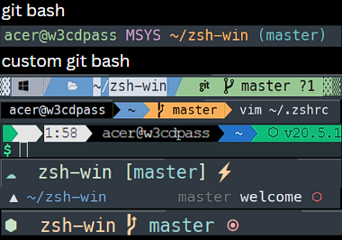
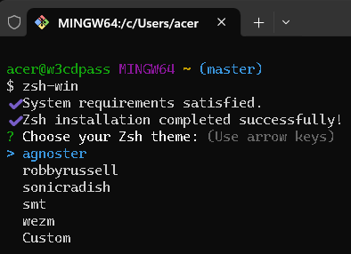

# zsh-win

<table width="100%">
  <tr>
    <td align="center" style="width: 50%;">
      
    </td>
    <td align="center" style="width: 50%;">
      
    </td>
  </tr>
</table>


# 🤓 Installtion
  * ## Prerequisites
    - **[Git Bash](https://git-scm.com/download/win)**: A command-line interface for Windows that provides a Unix-like shell. 
    - **[Node.js](https://nodejs.org/en/download/)**: A JavaScript runtime that allows you to run and install npm packages.  
****
### To avoid issue
1. Downloads these four .ttf files:

    - [MesloLGS NF Regular.ttf](https://github.com/romkatv/powerlevel10k-media/raw/master/MesloLGS%20NF%20Regular.ttf)
    - [MesloLGS NF Bold.ttf](https://github.com/romkatv/powerlevel10k-media/raw/master/MesloLGS%20NF%20Bold.ttf)
    - [MesloLGS NF Italic.ttf](https://github.com/romkatv/powerlevel10k-media/raw/master/MesloLGS%20NF%20Italic.ttf)
    - [MesloLGS NF Bold Italic.ttf](https://github.com/romkatv/powerlevel10k-media/raw/master/MesloLGS%20NF%20Bold%20Italic.ttf)

2. Double-click on each file and click "Install". This will make MesloLGS NF font available to all applications on your system.

Visual Studio Code: Open File → Preferences → Settings (PC) or Code → Preferences → Settings (Mac), enter `terminal.integrated.fontFamily` in the search box at the top of the Settings tab, and set the value to `MesloLGS NF`. Consult <a href="https://raw.githubusercontent.com/romkatv/powerlevel10k-media/389133fb8c9a2347929a23702ce3039aacc46c3d/visual-studio-code-font-settings.jpg" style="text-decoration: underline;">this screenshot</a> to see how it should look, or see <a href="https://github.com/romkatv/powerlevel10k/issues/671" style="text-decoration: underline;">this issue</a> for more information.


****
# Step #1
<div style="border-left: 4px solid yellow; padding-left: 10px;">
<strong style="color:yellow">IMPORTANT:</strong> <span style="text-decoration:underline;">Don't skip this step</span>.
</div>


## Run `git bash` as `admin`
  - **Press:** 
<span style="background-color:#e1e1e1;border-radius:3px;padding:2px 6px;color:black;"><strong>Windows</strong></span> + 
<span style="background-color:#e1e1e1;border-radius:3px;padding:2px 6px;color:black;"><strong>Key</strong></span> → 
<span style="background-color:#e1e1e1;border-radius:3px;padding:2px 6px;color:black;"><strong>Git Bash</strong></span> → 
<span style="background-color:#e1e1e1;border-radius:3px;padding:2px 6px;color:black;"><strong>Run as Administrator</strong></span>

</p>
  - Above instruction is not working `goto` issue <a href="#" style="text-decoration: underline;">git bash is not opening as admin on windows</a>.

****
# Step #2
  1. Install from `NPM`
```bash
npm i zsh-win # after installation
# type zsh-win on git bash to see the magic 🪄.
zsh-win
```
2. From `source code`
```
  git clone https://github.com/w3cdpass/zsh-win.git
  cd zsh-win
  npm i
  node js/index.cjs
```
   > Note: Run the `git bash` as `admin` to install from `source code`

# Step #3


- * Choose theme between them.
- * ❤️ Custom is great. If any issue with `custom` reffer this <a href="#issue" style="text-decoration:underline">issue</a>.

# Step #4⚡
# 🪄 After installation type `zsh-win` to see the magic in `git bash`

# Welcome to `Customization` ✨
- ## Example #1 🥱
  ```bash
  vim ~/.zshrc 
  ```
  - Search for `ZSH_THEME="agnoster"` .
  - Change the value `ZSH_THEME="cloud"` and save it .
  - Type `zsh` on `git bash` to activate theme .

  Note: You can select any `theme` from in zsh from <a href="https://github.com/ohmyzsh/ohmyzsh/wiki/Themes#robbyrussell" style="text-decoration:underline;">`ohmyzsh themes`</a> .
- ## Example #2 😎🔥
  * ### Wants to use another seprate `zsh theme` that is not in [~/.oh_my_zsh](https://github.com/ohmyzsh/ohmyzsh/tree/master/themes).
  Like <a href="https://github.com/romkatv/powerlevel10k" style="text-decoration:underline;">`powerlevel10k`</a> and [more](https://github.com/ohmyzsh/ohmyzsh/wiki/External-themes#simplerich-theme)
  ___
  ```bash
  #powelevel10k
  # use this cmd in git bash
  git clone --depth=1 https://github.com/romkatv/powerlevel10k.git ${ZSH_CUSTOM:-$HOME/.oh-my-zsh/custom}/themes/powerlevel10k

  sed -i.bak '/^ZSH_THEME=/c\ZSH_THEME="powerlevel10k/powerlevel10k"' ~/.zshrc

  ```
  - Then type `p10k configure`
